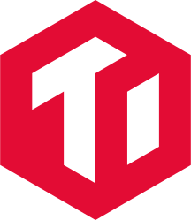
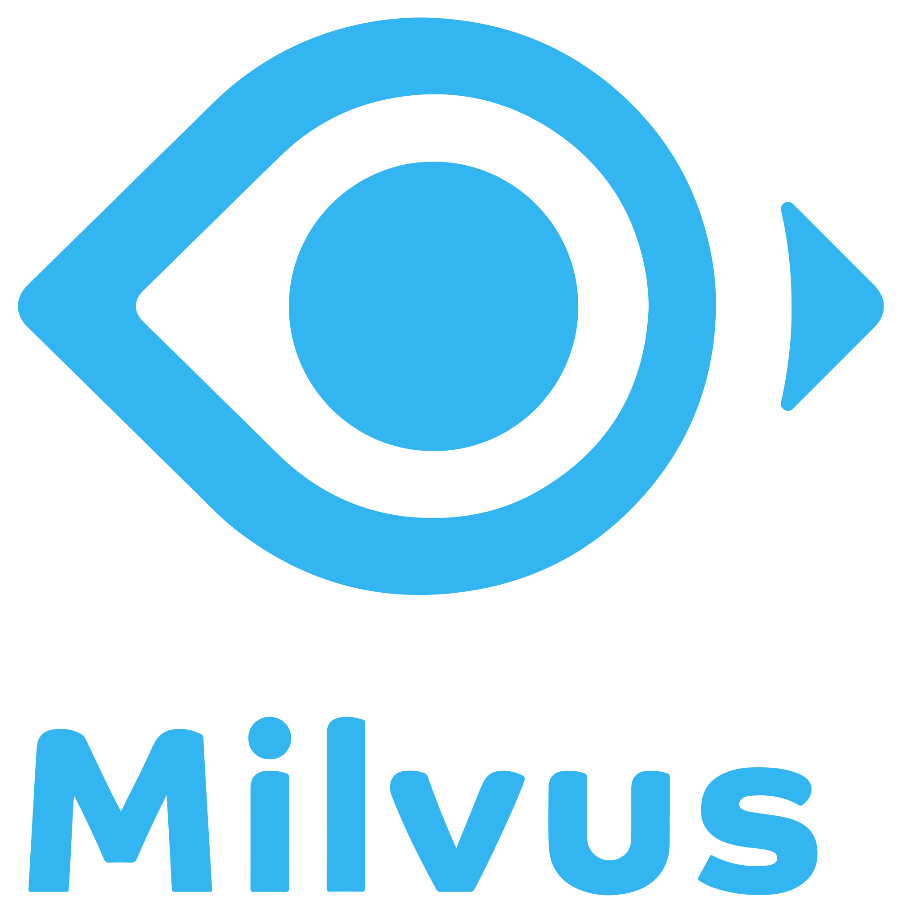
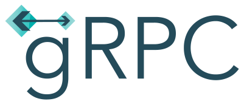

<h1> Hey! Nice to see you.</h1>

I'm Xiaopeng. I'm currently a software engineer at <strong><a href="https://www.sensetime.com/">SenseTime</a></strong>.

<h2 align="center">🚀 Languages & Frameworks & 🔨 Tools & Abilities </h2>

  

  
  
  
  
  

<h2 align="center">🔥 Github Stats </h2>

 
  
  

